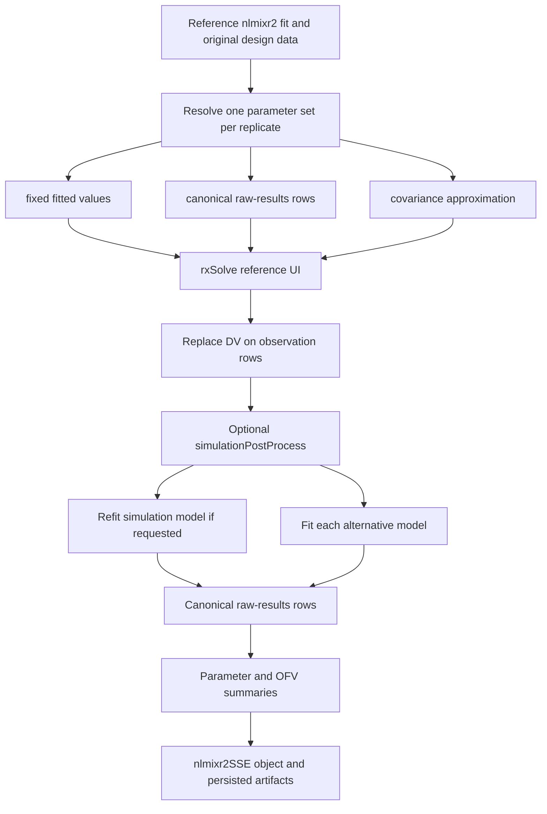

# `nlmixr2sse` technical reference

This document describes the stochastic simulation and estimation (SSE)
implemented by `nlmixr2sse` 0.1. It is a user-facing specification of the
current source code, not a general recipe for every simulation study. Source
references name functions rather than line numbers so that they remain useful
as the package evolves.

## Scope and statistical target

An SSE run approximates the repeated-sampling behavior of one or more analysis
models under a specified data-generating model, study design, parameter source,
and estimation procedure. For replicate \(i=1,\ldots,N\), the package:

1. chooses a simulation parameter set \(\psi_i=(\theta_i,\Omega_i,\Sigma_i)\);
2. simulates a new dependent variable on the reference fit's original event and
   covariate data;
3. fits the reference analysis model, if requested, and every alternative model
   to that same simulated dataset; and
4. summarizes parameter recovery, fit diagnostics, objective-function-value
   (OFV) differences, and empirical detection rates.

The resulting estimates are conditional on all of those choices. In particular,
they are not unconditional estimates of future-trial performance, a model
validation, or samples from a Bayesian posterior. Parameter uncertainty is
included only when `parameterSource = "rawres"` or `"covariance"` is selected,
and then only according to the distribution defined below.

Simulation-estimation studies are widely used to study parameter recovery,
model discrimination, design operating characteristics, and estimation-method
performance in nonlinear mixed-effects models. A worked application to error
models is given by Dosne et al. (2016), and Ueckert et al. (2016) develops the
parametric power extrapolation used by this package; see [Literature](#literature).

## Public interface

The workflow has four principal entry points:

| Function | Purpose |
| --- | --- |
| [`runSSE()`](../R/run-sse.R) | Execute or resume an SSE study and return an `nlmixr2SSE` object. |
| [`runSSEControl()`](../R/sse-control.R) | Select parameter sampling, filtering, parallelism, retention, and extension behavior. |
| [`sseModel()`](../R/sse-model.R) | Define an alternative analysis model from a fitted `nlmixr2FitCore` or an unfitted model/UI plus `est` and `control`. |
| [`recomputeSSE()`](../R/recompute-sse.R) | Rebuild summaries from a completed run without simulating or fitting again. |

A minimal call is:

```r
sse <- runSSE(
  fit = reference_fit,
  alternativeModels = list(
    sseModel(reduced_fit, label = "reduced")
  ),
  samples = 500,
  seed = 20260829,
  control = runSSEControl(workers = 4, rxThreads = 1)
)
```

`fit` must inherit from `nlmixr2FitCore` and expose its estimation method,
control object, simulation UI, and original data. A fitted alternative inherits
its UI, estimation method, and control unless these are overridden. An unfitted
alternative requires both `est` and `control`. Labels may contain letters,
numbers, underscores, and periods. An alternative's `data` argument is currently
recorded but ignored: every model is fitted to the dataset simulated from the
reference fit.

## Execution model



The implementation is split accordingly: parameter-source resolution and the
simulation/refit tasks are in [`R/sse-helpers.R`](../R/sse-helpers.R), the two
OMEGA sampling algorithms are in
[`R/sse-omega-draw.R`](../R/sse-omega-draw.R) and
[`R/sse-omega-joint.R`](../R/sse-omega-joint.R), and orchestration is in
[`R/run-sse.R`](../R/run-sse.R).

### Reference and alternative fits

With the default `estimateSimulation = TRUE`, the reference model is refitted
to every simulated dataset and its OFV is the replicate-specific comparison
reference. Alternatives are additional analysis hypotheses.

With `estimateSimulation = FALSE`, the reference model is not fitted. At least
one alternative is then required. If `refOfv` is absent, the first alternative's
OFV becomes the replicate-specific reference; its comparison with itself is
therefore identically zero. If `refOfv` is supplied, that scalar is the OFV
reference for every replicate and `estimateSimulation` must be `FALSE`.

The package does not establish that models are nested, identify which model is
larger, determine the appropriate null distribution, or verify that estimation
methods produce comparable OFVs. Those are study-design responsibilities.

## Simulation parameter sources

### Fixed values

`parameterSource = "fixed"` copies `fit$theta`, `fit$omega`, and `fit$sigma` to
every replicate. Only interindividual, interoccasion, and residual simulation
randomness varies. This mode estimates operating characteristics conditional on
the fitted point estimate.

Its strengths are simplicity, reproducibility, and a clear estimand. Its central
weakness is plug-in certainty: uncertainty in the population parameter estimates
does not contribute to the simulated between-study variability.

### Canonical raw-results rows

`parameterSource = "rawres"` reads a canonical raw-results data frame or path
with `nlmixr2utils::parseRawResultsParams()`. It applies `offsetRawres` (default
1), optionally applies `inFilter`, and uses the first `samples` remaining rows.
If an unfiltered input contains duplicate sample numbers and has a unique set of
SSE simulation-role rows, those rows are selected automatically. Fewer usable
rows than requested is an error.

Each selected row supplies THETA, OMEGA, and SIGMA for one simulation replicate.
This preserves whatever marginal shapes and joint dependence are present in the
source rows; suitable sources include bootstrap or sampling-importance-resampling
results. That is often preferable to a local Gaussian approximation when the
uncertainty distribution is asymmetric or bounded, but its quality is entirely
that of the upstream procedure and filtering. Dosne et al. (2017) discuss why a
covariance-matrix approximation can be too symmetric or too narrow for some
nonlinear mixed-effects models.

By default, estimation still starts from each analysis model's stored initial
values. `randomEstimationInits = TRUE` also replaces the free starting values
with the selected raw-results values. `updateFix = TRUE` updates matching fixed
values as well. These switches alter numerical initialization; they do not alter
which values generated the data. They are available only in raw-results mode.

### Covariance approximation

`parameterSource = "covariance"` constructs a local parametric approximation
from the reference fit. `fit$cov` must be a non-empty positive-definite square
matrix with matching, unique row and column names. Names matching `fit$theta`
are treated as THETA entries. OMEGA entries use the `nlmixr2est` names
`om.<eta>` for variances and `cov.<rowEta>.<colEta>` for covariances. An unknown
name is an error.

Only parameters represented in `fit$cov` can vary. Covered THETAs are drawn;
uncovered THETAs retain their fitted values. Typical nlmixr2 residual-error
parameters such as `add.sd` and `prop.sd` are THETAs and therefore vary when
covered. A separate `fit$sigma` matrix, if present, is held fixed in covariance
mode.

OMEGA topology is reconstructed from the reference UI. Off-diagonal entries
connect ETAs into blocks; a diagonal OMEGA gives one 1-by-1 block per ETA. A
block is drawable only if every declared entry in it is unfixed and represented
in `fit$cov`. If any entry is fixed or uncovered, the entire block is held at
its fitted value. This conservative all-or-none block rule avoids changing a
fixed component or splicing fixed entries into a draw and thereby losing
positive-definiteness. Drawn and fixed parameters, plus reasons for held OMEGA
blocks, are recorded in `runInfo$parameterSourceInfo$parameterPartition`.

Two covariance draw modes are available.

## `independent_iw` covariance draws

`covarianceDraw = "independent_iw"` is the default. It makes two independent
draws:

\[
\theta_i \sim N(\widehat\theta,\widehat V_{\theta\theta})
\]

for covered THETAs, and one inverse-Wishart draw for each fully covered OMEGA
block. THETA-OMEGA covariance, covariance between separate OMEGA blocks, and
OMEGA estimator covariances other than those induced by the chosen
inverse-Wishart distribution are discarded.

For a \(p\times p\) block, the implementation uses

\[
  \Omega_i \sim IW_p(\Psi,\nu), \qquad
  \Psi=(\nu-p-1)\widehat\Omega,
\]

so that \(E(\Omega_i)=\widehat\Omega\). If \(s_j\) is the standard error of
diagonal variance \(\widehat\Omega_{jj}\), obtained from the corresponding
diagonal of `fit$cov`, then

\[
  \operatorname{Var}(\Omega_{i,jj})
    = \frac{2\widehat\Omega_{jj}^2}{\nu-p-3},
  \qquad
  \nu_j=p+3+2\left(\frac{\widehat\Omega_{jj}}{s_j}\right)^2.
\]

There is only one \(\nu\) per block. The code chooses
\(\nu=\min_j\nu_j\), meaning that the diagonal with the largest relative
standard error binds and is matched exactly. Every other usable diagonal is
more dispersed than its reported standard error under the constructed
marginal. This is not a guarantee that predictions, tests, or other functions
of OMEGA are conservative.

Sampling is delegated to `rxode2::cvPost()`. Its input is pre-scaled by
\((\nu-p-1)/\nu\) to implement the mean-centered parameterization above.
Every returned block is positive-definite, subject to ordinary floating-point
limits.

Strengths:

- exact raw-scale mean centering at the fitted OMEGA;
- positive-definite OMEGA draws without rejection;
- transparent, inexpensive blockwise sampling; and
- no nonlinear back-transformation mean shift.

Weaknesses:

- discards estimated THETA-OMEGA and cross-block dependence;
- uses only diagonal OMEGA standard errors to calibrate dispersion;
- forces one tail/dispersion parameter on every variance and correlation in a
  block; and
- may substantially over-disperse nonbinding diagonal variances.

The last two points are structural inverse-Wishart limitations, not numerical
bugs. Barnard, McCulloch, and Meng (2000) discuss the inflexibility created by a
common degrees-of-freedom parameter and the coupling of variance and correlation
behavior.

## `joint` covariance draws

`covarianceDraw = "joint"` retains the covered covariance information by
drawing THETA and all drawable OMEGA blocks together. Direct Gaussian sampling
of OMEGA elements could yield an indefinite matrix, so each fitted block is
mapped to an unconstrained log-Cholesky vector.

For a block \(\Omega=LL^T\), where \(L\) is lower triangular with positive
diagonal, define \(\phi\) as the lower-triangular elements of \(L\) in
column-major order, with diagonal elements replaced by their logarithms. The
inverse map exponentiates the diagonal and reconstructs \(LL^T\). Pinheiro and
Bates (1996) describe this class of unconstrained covariance parameterizations.

Let \(\omega\) stack the natural-scale lower-triangular OMEGA entries and let
\(J=\partial\phi/\partial\omega\) at the fitted OMEGA. The code computes \(J\)
numerically using scale-aware central differences, step halving near the
positive-definite boundary, and a one-sided fallback. It then applies the
first-order delta method (Oehlert, 1992):

\[
  B=\operatorname{blockdiag}(I,J), \qquad
  V_T=B\widehat V B^T.
\]

One draw is made from

\[
  \begin{bmatrix}\theta_i\\\phi_i\end{bmatrix}
  \sim N\!\left(
    \begin{bmatrix}\widehat\theta\\\phi(\widehat\Omega)\end{bmatrix},
    V_T
  \right),
\]

and each \(\phi_i\) is transformed back to OMEGA. Thus the reported
THETA-OMEGA covariance, within-block OMEGA covariance, and covariance between
separate drawable blocks are retained to first order. `V_T` must itself be
positive-definite; otherwise the mode aborts and suggests another parameter
source or draw mode.

Strengths:

- uses substantially more of `fit$cov`, including THETA-OMEGA dependence;
- produces positive-definite OMEGA blocks without rejection; and
- can better represent joint uncertainty when the local covariance estimate is
  trustworthy and the transformed approximation is adequate.

Weaknesses:

- the delta-method covariance is only first-order;
- a Gaussian distribution on log-Cholesky coordinates is ordering-dependent
  and has limited direct statistical interpretation;
- nonlinear back-transformation changes raw-scale OMEGA moments; and
- numerical differentiation and Cholesky factorization can fail for nearly
  singular or extremely ill-conditioned inputs.

For a 1-by-1 block, the mean inflation is exactly

\[
  \frac{E(\Omega_i)}{\widehat\Omega}-1
  =\exp\!\left[\frac{1}{2}
    \left(\frac{s}{\widehat\Omega}\right)^2\right]-1
\]

under this delta-Gaussian construction: about 2.0% at 20% relative SE, 13.3%
at 50%, and 64.9% at 100%. For larger blocks the diagonal is a sum of squared
Cholesky elements, so the scalar expression is only a warning proxy, not the
actual blockwise bias. `omegaRseWarn` defaults to 0.5 and emits one warning per
affected block. The same threshold in `independent_iw` reports the implied
degrees of freedom instead.

### Choosing between the modes

Neither mode dominates. `independent_iw` is attractive when raw-scale
centering and robustness to transformation bias matter more than retaining
cross-covariance. `joint` is attractive when THETA-OMEGA dependence is
scientifically material, `fit$cov` is well conditioned, and OMEGA relative
standard errors are moderate. With weakly identified variance components, the
two modes answer meaningfully different approximation questions and should be
treated as sensitivity analyses. When credible bootstrap or SIR parameter
vectors are available, `rawres` avoids choosing between these two local
approximations and is generally the more direct way to propagate the empirical
joint uncertainty distribution.

In both covariance modes, THETA draws are untruncated. Bounds encoded in the
estimation model do not constrain simulation values, so a positive-scale or
otherwise bounded THETA can be drawn outside its valid domain. Users should
inspect `initialValues`, warnings, simulation failures, and the implied
scientific range before interpreting results.

## Dataset simulation

For each replicate, `.simulationRecord()` calls `rxode2::rxSolve()` on the
reference fit's UI with the selected THETA, OMEGA, and SIGMA, the original data
as events, `addCov = TRUE`, and a stable internal row identifier. The original
design, doses, event records, covariates, missingness indicators, and observation
times are therefore reused.

An observation row is one for which `EVID` is missing or zero and `MDV` is
missing or zero; absent columns are treated as zero. The package replaces `DV`
only on those rows with rxode2's `sim` output. It checks that the number of
simulated and original observation rows agrees. Requested `appendColumns` are
copied onto observation rows and are `NA` elsewhere.

`simulationPostProcess` runs after this merge. It may accept any subset of
`data`, `sample`, `paramSet`, `solved`, `referenceData`, and `outputDir`, or
`...`, and must return a data frame. Beyond that type check, the package cannot
verify that a hook preserves the event design or statistical meaning.

`initialEtas` is reserved and currently must be `FALSE`; individual ETAs are
drawn normally by `rxSolve()` from the selected OMEGA rather than supplied as
persisted replicate-specific initial values.

## Re-estimation

Every requested model is fitted with `nlmixr2est::nlmixr2()` to the same
replicate dataset. Its stored estimation method is retained, but
`nlmixr2utils::setQuietFastControl()` changes the repeated-fit control to
`print = 0`, `covMethod = 0`, `calcTables = FALSE`, and `compress = FALSE`.
Consequently, SSE refits target estimates and OFVs rather than a covariance step
or model tables.

A thrown fitting error is caught. The raw-results row receives an
`error_message` and missing OFV/diagnostics, and an `nlmixr2SSEFitError` artifact
is saved when `saveFits = TRUE`. A fit that returns normally but has an
unsuccessful-minimization flag is not automatically rejected. Summary rows with
nonmissing `error_message` are always excluded; use `outFilter` to exclude
other undesirable termination, boundary, precision, or condition-number states.
Different models can therefore have different effective replicate counts.

## Parameter summaries

The simulation parameter vector saved in `initial_estimates.csv` is the
replicate-specific truth. Parameters are matched by the canonical schema names
used by `nlmixr2utils`, including named THETAs and matrix-coordinate OMEGA/SIGMA
labels. A model without a parameter receives `matched = FALSE`, `NA` statistics,
and effective count zero for that parameter.

For valid estimates \(\widehat x_i\) and matched truths \(x_i\), the principal
statistics are:

\[
\begin{aligned}
\operatorname{RMSE} &= \sqrt{N^{-1}\sum_i(\widehat x_i-x_i)^2},\\
\operatorname{bias} &= N^{-1}\sum_i(\widehat x_i-x_i),\\
\operatorname{relative\ RMSE} &=100\sqrt{N^{-1}\sum_i
  \left(\frac{\widehat x_i-x_i}{x_i}\right)^2},\\
\operatorname{relative\ bias} &=100N^{-1}\sum_i
  \frac{\widehat x_i-x_i}{x_i},\\
\operatorname{relative\ absolute\ bias} &=100N^{-1}\sum_i
  \left|\frac{\widehat x_i-x_i}{x_i}\right|.
\end{aligned}
\]

Rows with missing estimates or truths are omitted pairwise. Relative statistics
also omit replicates whose truth is zero. Mean, median, sample SD, minimum,
maximum, bias-corrected sample skewness, and excess kurtosis are reported.
Every long-form statistic has its own `n_effective`.

The statistic named `rse` is not a model-fit parameter RSE. It is the Monte
Carlo standard error of relative bias,

\[
  100\,\frac{\operatorname{SD}(\widehat x)}{x_0\sqrt N},
\]

and is calculated only when every matched truth equals the same finite nonzero
\(x_0\). The `ci_*` values are normal-approximation limits formed as relative
bias plus this quantity times the corresponding standard-normal quantile. These
fields are therefore unavailable for varying-truth `rawres` and covariance
runs. Because the implementation divides by \(x_0\), rather than
\(|x_0|\), the interval fields should not be interpreted for a negative fixed
truth without re-expressing the parameter.

## OFV differences, empirical power, and Type I error

For each alternative and replicate, the internal difference is

\[
  \Delta_i=\operatorname{OFV}_{\mathrm{reference},i}
           -\operatorname{OFV}_{\mathrm{alternative},i}.
\]

The package reports `mean_delta_ofv` and, for hard-coded thresholds
0, 3.84, 5.99, 7.81, 9.49, and 10.83:

\[
\begin{aligned}
\texttt{pct_delta_above}(c)&=100\Pr_N(\Delta_i>c),\\
\texttt{pct_delta_below}(c)&=100\Pr_N(\Delta_i<-c).
\end{aligned}
\]

The latter is labeled `direction = "power"` and corresponds to the common
setup in which the reference is the fitted full/data-generating model and the
alternative is reduced: the likelihood-ratio statistic is then
\(T_i=-\Delta_i=\operatorname{OFV}_{reduced}-\operatorname{OFV}_{full}\).
The former is labeled `direction = "type1"`. These labels encode tail
directions only; the software does not infer the scientific null or alternative.

The positive thresholds are merely convenient common chi-square values. The
user must select the value and null distribution appropriate to the number and
kind of restrictions. Standard chi-square asymptotics can fail for parameters
on boundaries, such as testing a variance against zero; Self and Liang (1987)
describe the resulting nonstandard likelihood-ratio limits. Empirical null SSE
is one way to estimate the actual Type I error of a proposed decision rule.

## Parametric power estimation

`plotSSEPpePower()` extrapolates power from the simulated study size using the
methodological idea of Ueckert et al. (2016). For each model and positive
threshold \(c\), it sets \(T_i=-\Delta_i\), counts
\(K=\sum_i I(T_i>c)\), and uses \(K/N\) as the base-study detection rate. Zero
and one are clipped to \(0.5/(N+1)\) and \(1-0.5/(N+1)\) before inversion.

The degrees of freedom are calculated as

\[
  d=\max\{1,\ p_{simulation}-p_{alternative}\},
\]

where each \(p\) is the number of schema THETA, OMEGA, and SIGMA columns. The
noncentrality \(\lambda_0\) solves

\[
  \Pr\{\chi^2_d(\lambda_0)>c\}=K/N.
\]

If the clipped observed rate is no greater than the central chi-square tail
probability at \(c\), no nonnegative noncentrality can reproduce it and the
implementation sets \(\lambda_0=0\). The numerical inversion otherwise expands
the search interval up to a noncentrality of \(10^6\).

For a requested study size \(n\), with base size \(n_0\), the implementation
assumes linear scaling \(\lambda(n)=\lambda_0n/n_0\) and plots

\[
  100\Pr\{\chi^2_d(\lambda(n))>c\}.
\]

The base size is the number of unique nonmissing values in a case-insensitive
`ID` column; if no such column exists, it is the number of data rows and the
unit is recorded as observations. The default grid runs from one to the
estimated size reaching `targetPower` (99% by default), with at most 200 grid
points above size 300. If the point noncentrality is zero, the default grid ends
at the base study size instead.

The ribbon maps a two-sided Clopper-Pearson interval for \(K/N\) through the
same noncentral-chi-square inversion and linear scaling. It represents Monte
Carlo uncertainty in the observed pass rate, not uncertainty in model
specification, effect size, covariance estimation, the scaling law, or the
chi-square approximation.

PPE requires nested, consistently fitted models; an appropriate degrees of
freedom and threshold; a noncentral chi-square approximation at the base size;
and approximate proportionality of noncentrality to sample size over the plotted
range. `nlmixr2sse` does not test these assumptions, and its simple parameter
count can be wrong for fixed, constrained, boundary, or non-nested hypotheses.
It also requires the reference fit to have been included in the replicate fits:
because its degrees-of-freedom calculation reads the simulation-model schema,
`plotSSEPpePower()` is unavailable for runs made with
`estimateSimulation = FALSE`. Use direct SSE at more than one study size when
the extrapolation assumptions are doubtful.

## Returned object and plots

An `nlmixr2SSE` object is a list with:

| Element | Contents |
| --- | --- |
| `runInfo` | Inputs, resolved controls, seed, thread count, parameter partition, model/schema snapshots, study-size metadata, status, timestamps, and failure count. |
| `referenceValues` | Replicate-specific simulation truths, with columns ordered `parameter`, `replicate`, `value`. |
| `initialValues` | The same truths, with columns ordered `replicate`, `parameter`, `value`. |
| `rawResults` | One canonical row per model-replicate fit, including estimates, OFV, diagnostics, and caught errors. |
| `parameterSummary` | Long-form statistic table with `matched` and `n_effective`. |
| `ofvSummary` | Mean ΔOFV plus both threshold tails. |
| `powerSummary` | The `direction = "power"` subset of `ofvSummary`. |
| `alternativeSpecs` | Persisted alternative-model metadata. |
| `outputDir`, `timestamp` | Run location and completion/load time. |

`summary()` widens the parameter and OFV tables for display. Plot helpers return
ordinary `ggplot2` objects:

- `plotSSEParameterBias()` plots one parameter statistic;
- `plotSSEParameterEstimates()` plots replicate estimates and optional truths;
- `plotSSEOfvDistribution()` plots the stored \(\Delta\) distribution;
- `plotSSEPower()` plots an empirical tail percentage by threshold;
- `plotSSEPpePower()` plots the parametric sample-size extrapolation; and
- `plotSSEDiagnostics()` combines four panels and requires `patchwork`.

## Persistence, resume, extension, and recomputation

A completed run normally contains:

| Artifact | Meaning |
| --- | --- |
| `run_info.rds` | Full run provenance and completed status. |
| `sse_state.rds` | Phase and completed-task state. |
| `sse_seed.rds` | Persisted master seed. |
| `sse_data_cache/` | Per-replicate simulation records used for resume. |
| `sse_fit_rows_cache/` | Per-model/replicate fit-result rows used for resume. |
| `simulations/sim_NNNN.csv`, `.rds` | User-facing simulated datasets when `saveDatasets = TRUE`. |
| `fits/<label>_NNNN.rds` | Full fit or structured fit error when `saveFits = TRUE`. |
| `initial_estimates.csv` | Replicate-specific simulation parameters. |
| `raw_results.csv`, `raw_results.rds`, `raw_results_header.json` | Canonical fit-level results. |
| `sse_results.csv` | Wide parameter summaries. |
| `sse_summary.rds` | Run information and tidy parameter/OFV/power summaries. |

The caches remain part of the run machinery even when user-facing fit or
dataset retention is disabled. `saveDatasets = FALSE` prevents the
`simulations/` CSV/RDS pair and therefore prevents later `addModels`, which
requires the saved RDS datasets.

Rerunning a compatible incomplete directory with `restart = FALSE` schedules
only missing simulation and fit task keys. A compatible completed directory is
loaded. Resume checks the fit label, replicate count, parameter source,
`estimateSimulation`, model-label set, resolved rxode2 thread count, and the
covariance draw mode. `restart = TRUE` replaces the run directory and cannot be
combined with `addModels`.

`addModels = TRUE` operates only on a completed run, reuses its saved datasets,
and fits only new, noncolliding alternative labels. It preserves the original
simulation provenance and writes `raw_results_add<k>.*` and
`sse_results_add<k>.csv` in addition to updating combined outputs.

`recomputeSSE()` reads completed raw results and truths, optionally selects the
first `samples` replicates, changes `outFilter` and/or `refOfv`, and recomputes
summaries without fitting. By default it writes suffixed
`sse_results_recompute<k>.csv` and `sse_summary_recompute<k>.rds`; with
`overwrite = TRUE` it replaces the main summary artifacts, not raw results.

## Parallelism and reproducibility

`workers` selects sequential execution, the current `future` plan, an automatic
multisession plan, or an explicit worker count. `rxThreads` sets rxode2 threads
per worker; `"auto"` divides available cores among workers. Oversubscription is
rejected when it can be detected.

The master seed is persisted. Covariance parameter draws use keys
`covariance-<replicate>` and simulations use `simulation-<replicate>`, making
those stages independent of task scheduling and safe to resume. Parallel task
application also requests parallel-safe future RNG streams. Nevertheless,
rxode2's thread count can change simulated values, so the resolved integer is
part of run provenance and a mismatch aborts resume. For reproducibility across
machines, set an explicit `seed`, `workers`, and integer `rxThreads` and retain
the run directory.

Stochastic estimation methods may consume RNG inside the fitting engine. Fit
tasks are not assigned the same explicit per-model/replicate keys as simulation
tasks, so exact bitwise reproduction of such estimators across different
parallel plans, resume boundaries, package versions, compilers, or hardware
should not be assumed.

## Interpretation checklist and limitations

Before reporting an SSE result, verify:

- the data-generating parameter source answers the intended question;
- raw-results rows or covariance draws are scientifically plausible;
- `runInfo$parameterSourceInfo$parameterPartition` shows the intended parameters
  as drawn rather than fixed;
- full and reduced models, OFV sign, threshold, and degrees of freedom define
  the intended hypothesis test;
- `outFilter` handles nonconvergence, boundaries, and other unacceptable fits;
- effective replicate counts and Monte Carlo error are adequate;
- parameter names represent the same scientific quantities across models;
- the original event data and any `simulationPostProcess` represent the planned
  design, including adaptive or censored-data logic; and
- PPE assumptions are checked with direct SSE at additional study sizes when
  sample-size decisions are consequential.

Important current limitations are: alternative-model data overrides are
ignored; initial ETA control is unavailable; covariance THETA draws are not
bounded or truncated; covariance sampling is an asymptotic approximation rather
than posterior inference; OMEGA coverage is deliberately all-or-none per block;
successful-but-problematic fits require an explicit output filter; no nesting or
null-distribution checks are performed; and PPE uncertainty bands cover Monte
Carlo counting error only. PPE plotting additionally requires
`estimateSimulation = TRUE`.

## Difference from PsN

The high-level repeated simulation/refit loop and the principal bias and OFV summaries follow the same tradition, but the implementations diverge materially: PsN generates and executes NONMEM control streams and table datasets, matches parameter comparisons primarily by numbering, and by default can include readable estimates from unsuccessful minimizations unless filtered, whereas `nlmixr2sse` calls `rxSolve()`/`nlmixr2()` directly, uses canonical named parameter schemas, catches thrown fit errors, and persists keyed R tasks. For parameter uncertainty, PsN supports raw-results input, an NM7 covariance-file mode that samples all represented THETA/OMEGA/SIGMA elements jointly as an unconstrained multivariate Normal, and predeclared NONMEM `NWPRI`/`TNPRI` models whose sampling is performed by NONMEM; its helper for constructing NWPRI records requires user-supplied block degrees of freedom. `nlmixr2sse` instead provides raw-results sampling and the positive-definite `independent_iw` and `joint` covariance approximations documented above; neither is NWPRI or TNPRI. PsN's PPE templates also include an extended distributional diagnostic, while the current `nlmixr2sse` PPE plot provides the extrapolated curve and Monte Carlo ribbon but does not implement that diagnostic. This comparison is based on PsN's [`tool::sse`](https://github.com/UUPharmacometrics/PsN/blob/master/lib/tool/sse.pm), covariance sampler in [`model.pm`](https://github.com/UUPharmacometrics/PsN/blob/master/lib/model.pm), prior builder in [`model/problem.pm`](https://github.com/UUPharmacometrics/PsN/blob/master/lib/model/problem.pm), and [SSE user guide](https://github.com/UUPharmacometrics/PsN/releases/download/v5.7.0/sse_userguide.pdf).

## Literature

1. Ueckert S, Karlsson MO, Hooker AC. Accelerating Monte Carlo power studies
   through parametric power estimation. *Journal of Pharmacokinetics and
   Pharmacodynamics*. 2016;43:223-234.
   [doi:10.1007/s10928-016-9468-y](https://doi.org/10.1007/s10928-016-9468-y).
   This is the primary reference for the noncentral-chi-square PPE assumptions
   and sample-size scaling.

2. Pinheiro JC, Bates DM. Unconstrained parametrizations for variance-covariance
   matrices. *Statistics and Computing*. 1996;6:289-296.
   [doi:10.1007/BF00140873](https://doi.org/10.1007/BF00140873). This motivates
   log-Cholesky and related positive-definite parameterizations.

3. Oehlert GW. A note on the delta method. *The American Statistician*.
   1992;46:27-29.
   [doi:10.1080/00031305.1992.10475842](https://doi.org/10.1080/00031305.1992.10475842).
   This is the statistical basis for the first-order covariance transformation
   in `joint` mode.

4. Barnard J, McCulloch R, Meng X-L. Modeling covariance matrices in terms of
   standard deviations and correlations, with application to shrinkage.
   *Statistica Sinica*. 2000;10:1281-1311.
   [Article](https://www3.stat.sinica.edu.tw/statistica/j10n4/10-4.htm). This
   discusses restrictions of a single inverse-Wishart distribution and
   alternatives based on separating scales and correlations.

5. Dosne A-G, Bergstrand M, Karlsson MO. An automated sampling importance
   resampling procedure for estimating parameter uncertainty. *Journal of
   Pharmacokinetics and Pharmacodynamics*. 2017;44:509-520.
   [doi:10.1007/s10928-017-9542-0](https://doi.org/10.1007/s10928-017-9542-0).
   This evaluates covariance-matrix, bootstrap, SSE, and SIR uncertainty
   behavior in nonlinear mixed-effects models.

6. Dosne A-G, Bergstrand M, Karlsson MO. A strategy for residual error modeling
   incorporating scedasticity of variance and distribution shape. *Journal of
   Pharmacokinetics and Pharmacodynamics*. 2016;43:137-151.
   [doi:10.1007/s10928-015-9460-y](https://doi.org/10.1007/s10928-015-9460-y).
   This provides a concrete SSE application to parameter recovery and Type I
   error.

7. Self SG, Liang K-Y. Asymptotic properties of maximum likelihood estimators
   and likelihood ratio tests under nonstandard conditions. *Journal of the
   American Statistical Association*. 1987;82:605-610.
   [doi:10.1080/01621459.1987.10478472](https://doi.org/10.1080/01621459.1987.10478472).
   This is relevant when a tested parameter lies on the boundary and ordinary
   chi-square reference values do not apply.

## Implementation index

- Orchestration, model scheduling, persistence, and return construction:
  [`runSSE()`](../R/run-sse.R)
- Control validation: [`runSSEControl()`](../R/sse-control.R)
- Alternative model normalization: [`sseModel()`](../R/sse-model.R)
- Parameter sources, simulation/refit tasks, and summaries:
  [`.resolveSimulationParameters()`, `.simulationRecord()`,
  `.fitTaskRecord()`, and `.computeSSEOutputs()`](../R/sse-helpers.R)
- Independent inverse-Wishart blocks: [`.omegaWishartSpec()` and
  `.drawOmegaBlock()`](../R/sse-omega-draw.R)
- Joint transformed draw: [`.jointDrawSpec()` and
  `.drawJoint()`](../R/sse-omega-joint.R)
- Resume, add-model support, and recomputation:
  [`recomputeSSE()` and related state helpers](../R/recompute-sse.R)
- Plot data and public graphics: [`R/plot-sse.R`](../R/plot-sse.R)
- Printed summaries: [`R/sse-methods.R`](../R/sse-methods.R)
